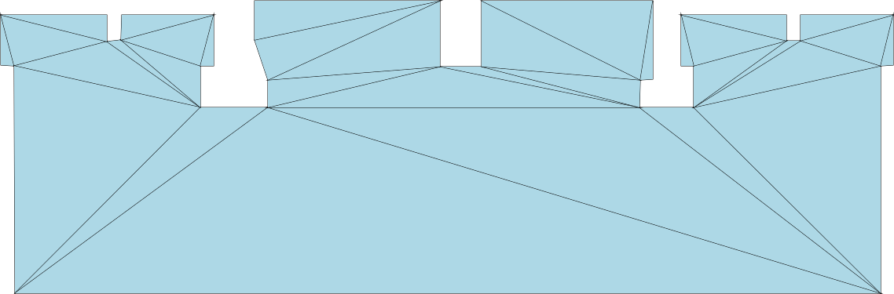

# PNG to Box2D

A CLI to convert PNG images to Box2D shape data. Based on [anko/image-to-box2d-body](https://github.com/anko/image-to-box2d-body).

[](https://oclif.io)
[](https://dev.azure.com/jmerle/png-to-box2d/_build/latest?definitionId=8&branchName=master)
[](https://npmjs.org/package/png-to-box2d)
[](https://github.com/jmerle/png-to-box2d/blob/master/package.json)

# Install

```
$ npm install --global png-to-box2d
# or
$ yarn global add png-to-box2d
```

The following commands must be available on your `PATH`:
* [ImageMagick's `convert`](https://imagemagick.org/)
* [`potrace`](http://potrace.sourceforge.net/)

# Usage

Use the [`generate`](#png-to-box2d-generate-input-output) command to convert a PNG file to a JSON file containing all shapes in the PNG file converted to one or more triangles. This data can be used in Box2D to build bodies that have hitboxes similar to the image that is displayed on them, which is useful for things like collision detection.

The generated JSON file will have the following format:

```json
{
  "shapes": [
    [
      [{ "x": 253, "y": 148 }, { "x": 85, "y": 93 }, { "x": 50, "y": 160 }],
      [{ "x": 64, "y": 91 }, { "x": 50, "y": 160 }, { "x": 85, "y": 93 }],
      [{ "x": 71, "y": 83 }, { "x": 64, "y": 91 }, { "x": 85, "y": 93 }],
      ...
    ],
    [
      [{ "x": 12, "y": 115 }, { "x": 1, "y": 129 }, { "x": 25, "y": 154 }],
      [{ "x": 27, "y": 97 }, { "x": 12, "y": 115 }, { "x": 25, "y": 154 }],
      [{ "x": 25, "y": 154 }, { "x": 47, "y": 92 }, { "x": 27, "y": 97 }],
      ...
    ]
  ]
}
```

The `shapes` array contains all shapes. Each shape is an array of triangles, each containing three coordinates. (0, 0) is seen as the top-left corner of the image.

The [`image`](#png-to-box2d-image-input-output) command can be used to visualize the generated JSON file. Simply run `png-to-box2d image triangles.json image.png` and the `image.png` file will contain a visualization of the triangles defined in `triangles.json`.

# Example

`images/castle.png`:


```
$ png-to-box2d generate images/castle.png out/triangles.json
Converted image in images/castle.png to triangles in out/triangles.json

$ png-to-box2d image out/triangles.json out/image.png
Converted triangles in out/triangles.json to image in out/image.png
```

`out/image.png`:


# Commands

<!-- commands -->
* [`png-to-box2d generate INPUT [OUTPUT]`](#png-to-box2d-generate-input-output)
* [`png-to-box2d help [COMMAND]`](#png-to-box2d-help-command)
* [`png-to-box2d image INPUT OUTPUT`](#png-to-box2d-image-input-output)

## `png-to-box2d generate INPUT [OUTPUT]`

convert a PNG image to Box2D shape data

```
USAGE
  $ png-to-box2d generate INPUT [OUTPUT]

ARGUMENTS
  INPUT   path to PNG image to generate Box2D shape data for
  OUTPUT  [default: {INPUT}.json] where the generated JSON file should be placed

OPTIONS
  -h, --help                 show CLI help
  -o, --overwrite            overwrite the output file if it exists

  -t, --tolerance=tolerance  [default: 2.5] path tolerance in px where less tolerance means more triangles per shape
                             see https://mourner.github.io/simplify-js/ for more information

  -v, --verbose

EXAMPLES
  $ png-to-box2d generate images/castle.png
  Converted image in images/cannon.png to triangles in images/castle.png.json

  $ png-to-box2d generate --overwrite --tolerance 5 images/castle.png out/triangles.json
  Converted image in images/cannon.png to triangles in out/triangles.json
```

_See code: [src/commands/generate.ts](https://github.com/jmerle/png-to-box2d/blob/v1.0.0/src/commands/generate.ts)_

## `png-to-box2d help [COMMAND]`

display help for png-to-box2d

```
USAGE
  $ png-to-box2d help [COMMAND]

ARGUMENTS
  COMMAND  command to show help for

OPTIONS
  --all  see all commands in CLI
```

_See code: [@oclif/plugin-help](https://github.com/oclif/plugin-help/blob/v2.2.1/src/commands/help.ts)_

## `png-to-box2d image INPUT OUTPUT`

convert generated Box2D shape data to an image for debugging

```
USAGE
  $ png-to-box2d image INPUT OUTPUT

ARGUMENTS
  INPUT   path to JSON file containing shape data generated by the `generate` command
  OUTPUT  where the generated PNG image should be placed

OPTIONS
  -h, --help       show CLI help
  -o, --overwrite  overwrite the output file if it exists
  -v, --verbose

EXAMPLE
  $ png-to-box2d image out/triangles.json out/image.png
  Converted triangles in out/triangles.json to image in out/image.png
```

_See code: [src/commands/image.ts](https://github.com/jmerle/png-to-box2d/blob/v1.0.0/src/commands/image.ts)_
<!-- commandsstop -->
